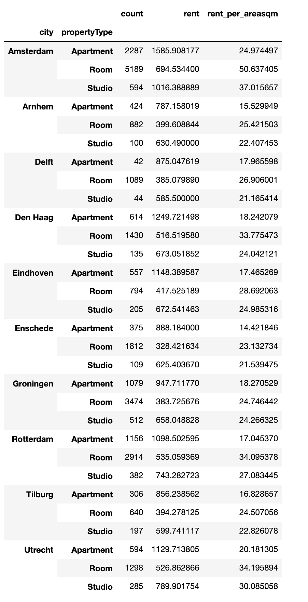
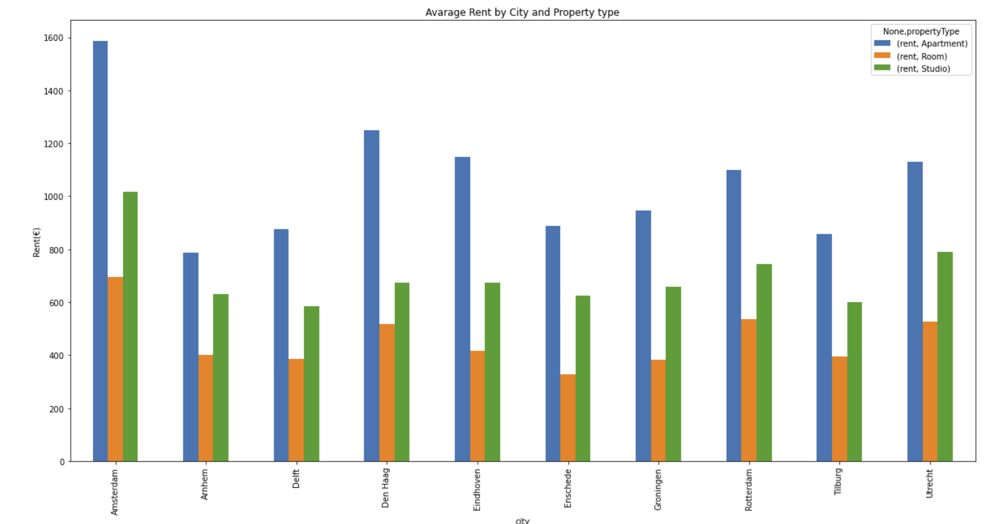
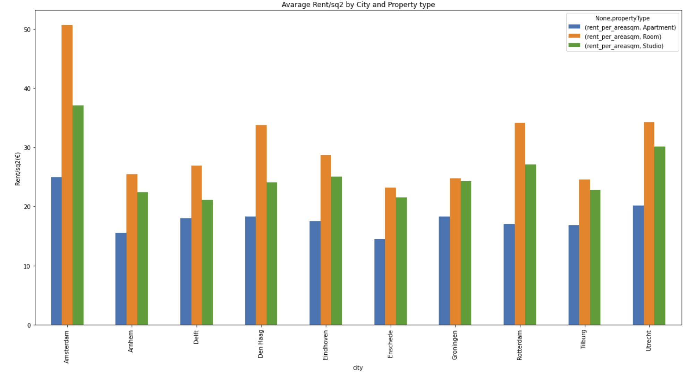
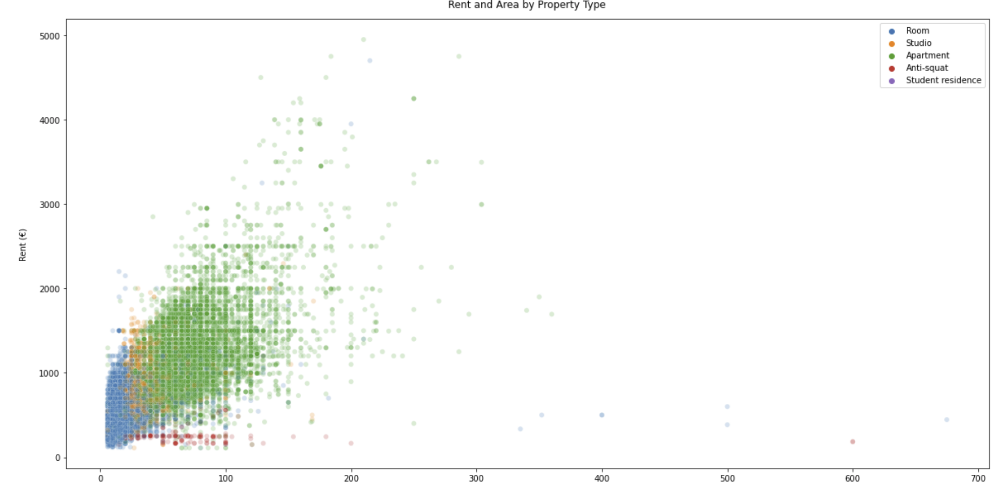
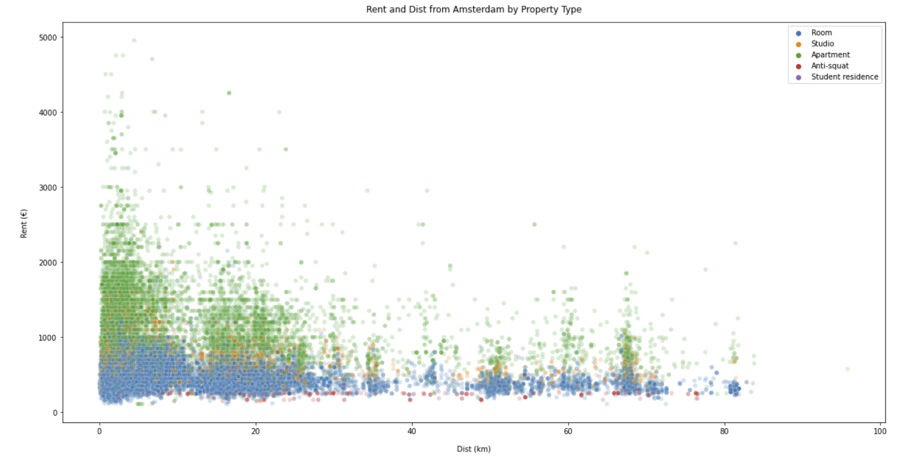
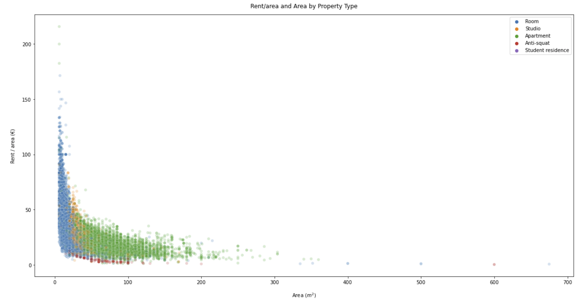
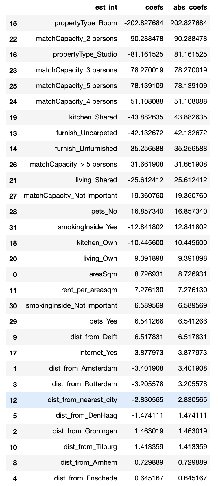
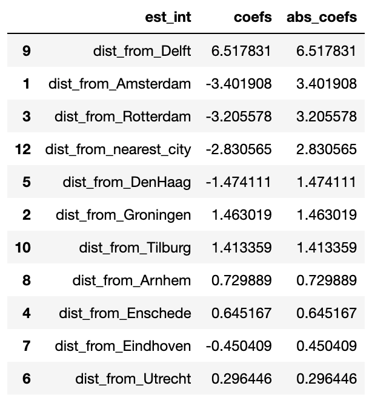

# Data on the rentals in the Netherlands

It is becoming increasingly difficult to find a rental property in the Netherlands. For my data science exercise, we’ll use Kaggle’s dataset to analyse an overview of the rental market in the Netherlands.

This is part of Udacity's Datascience Nanodegree project.

details blog post is https://medium.com/@togawamanabu/data-on-the-rentals-in-the-netherlands-a202df97be95

and 

Juputer notebook is **proj1.ipynb** in this repository.

### Dataset

RentalProperties Dataset in the Netherlands from Kaggle
https://www.kaggle.com/juangesino/netherlands-rent-properties?select=properties.json

### Files

 - README.me : This readme file
 - proj1.ipynb : Main Jupter note book and program.
 - data/ : directory to put dataset from Dataset above.

### Program and Libraries

- Python 3.8.8 : https://www.python.org/
- Jupyter Notebook : https://jupyter.org/
- Pandas : https://pandas.pydata.org/
- NumPy : https://numpy.org/
- Matplotlib : https://matplotlib.org/
- Seaborn : https://seaborn.pydata.org/
- Scikit-lean : https://scikit-learn.org/stable/

## Questions and result 
 - Which area is most expensive to live?

If you want to live in an apartment, Amsterdam is the most expensive city with an average of 1600€/month, followed by Den Haag at 1250€/m and Enschede, Rotterdam and utrecht at around 1100€/m.
For a room, 700€/m in Amsterdam, but the price per square meter will be the highest at 50€/m.

 - Compare price and space, what type of property is good value?

It is obvious that the price per unit area of the room is higher. The larger the area, the exponentially lower the price per unit area.
If you are a landlord, renting out a smaller room at a higher price seems to be more profitable, but if you are a tenant, renting a larger apartment seems to be a better choice!

 - Which feature have the greatest impact on price?

From this table, we can see that single-person rooms are a major factor in lowering rent price.
Table blow is only the data related to the city, we can see that the rent increases the closer we get to Delft.

## Conclusion
Using 46,000 data about rental properties in the Netherlands, we were able to find the answers, city with the highest rent, the property with the best value for the price per area, and the factors that determine the price.
If you are a lender, you can use this model to set the optimal price.
If you are a tenant, you should be able to find cost-effective properties by looking for properties that outliner from this model.
